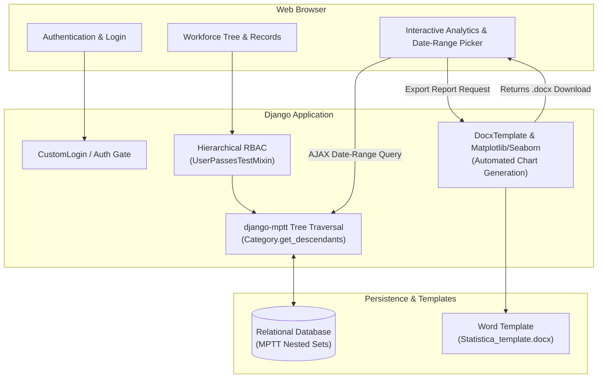

# Enterprise Hierarchical Workforce & Discipline Tracking System

<p align="center">
  <strong>Scalable corporate workforce performance and discipline management platform with recursive organizational hierarchy modeling</strong>
</p>

<p align="center">
  
  
  
  
  
  
</p>

---

## 🏢 Overview

**Enterprise Hierarchical Workforce & Discipline Tracking System** is a production-oriented web platform designed for enterprises with deep organizational structures (Headquarters $\to$ Branches $\to$ Departments $\to$ Operational Units). It enables companies to systematize performance evaluations, maintain auditable records of commendations and disciplinary measures, generate compliance reports, and visualize workforce metrics across hierarchical tiers.

The platform solves the challenge of strictly delegating visibility and authority: department heads can only inspect and record events for employees within their specific organizational branch and descendant subunits.

---

## 🎥 Демонстрация работы / Live Demo

<p align="center">
  
</p>

> [!NOTE]
> *Видео и GIF демонстрации работы платформы (навигация по MPTT-оргструктуре, фиксация событий, расчёт аналитики и генерация DOCX-отчётов) размещены в каталоге [`docs/`](docs/).*

---

## ⚡ Key Engineering Features

### 1. Recursive Hierarchy Modeling (`django-mptt`)
* Implements **Modified Preorder Tree Traversal (MPTT)** for high-efficiency querying of multi-level corporate structures.
* Rapidly traverses arbitrary organizational depths (`get_descendants(include_self=True)`) without recursive database queries or performance penalties ($O(1)$ read complexity for descendant trees).
* Features interactive nested administrative management via `django-mptt-admin`.

<p align="center">
  
</p>

### 2. Hierarchical Role-Based Access Control (RBAC)
* Granular permission gates enforced through Django's `UserPassesTestMixin`.
* Multi-tier role ladder:
  * **Team Lead / Head of Unit**: Visibility and record management confined strictly to their unit.
  * **Department Head / Director**: Aggregated overview of all descendant branches.
  * **Staff Specialist**: Personal discipline and commendation history ledger.
* Non-sequential slug generation using UUID-salted transliteration to protect against ID enumeration.

### 3. Automated Executive Document Generation (`docxtpl`)
* Generates formatted, executive-ready `.docx` compliance documents populated dynamically from database statistics.
* Server-side on-the-fly data visualization via **Matplotlib** and **Seaborn** (headless backend rendering with `plt.switch_backend('agg')`).
* Dynamic embedding of generated analytics charts directly into the target document template.

### 4. Interactive Analytics & Date Filtering
* Asynchronous AJAX queries for instant period aggregation (commendations, disciplinary notes, resolution of prior penalties).
* Dynamic donut chart visualization rendered on the client via **Chart.js**.

<p align="center">
  
</p>

---

## 🏛️ System Architecture & Data Flow



---

## 📂 Project Structure

```
disciplinary_practice_31_courses/
├── disciplinary_practice/     # Project configuration & settings
│   ├── settings.py           # Environment-configured settings (SECRET_KEY, DEBUG)
│   ├── urls.py               # Root URL declarations
│   ├── wsgi.py               # WSGI production entrypoint
│   └── asgi.py               # ASGI asynchronous entrypoint
├── docs/                      # Demonstration media (GIF / video) and project assets
├── main/                      # Core business application
│   ├── models.py             # Category (MPTT), CustomUser, Note models
│   ├── views.py              # RBAC views, AJAX analytics, Docx export
│   ├── forms.py              # Authenticated user & record forms
│   ├── admin.py              # Django & MPTT admin configuration
│   ├── static/               # CSS, JS (Chart.js, Bootstrap 5), docx templates
│   └── templates/            # Corporate UI templates & error layouts
├── .env.template             # Environment variables blueprint
├── requirements.txt          # Python dependencies
└── manage.py                 # Django management CLI
```

---

## 🚀 Setup & Installation Guide

### 1. Prerequisites
* Python 3.10 or higher
* Git

### 2. Clone and Setup Environment
```bash
# Navigate to the project directory
cd disciplinary_practice_31_courses

# Create a Python virtual environment
python -m venv venv

# Activate the virtual environment
# On Linux/macOS:
source venv/bin/activate
# On Windows (PowerShell):
.\venv\Scripts\Activate.ps1
```

### 3. Install Dependencies
```bash
pip install -r requirements.txt
```

### 4. Configure Environment Variables
Copy `.env.template` to `.env` and configure your settings:
```bash
cp .env.template .env
```

Edit `.env`:
```env
SECRET_KEY=generate_a_secure_random_key_here
DEBUG=True
ALLOWED_HOSTS=127.0.0.1,localhost
```

### 5. Apply Migrations & Initialize
```bash
# Apply database migrations
python manage.py makemigrations
python manage.py migrate

# Create an administrator account
python manage.py createsuperuser
```

### 6. Run the Development Server
```bash
python manage.py runserver
```

Open your browser and navigate to:
* **Application**: `http://127.0.0.1:8000/`
* **Admin Portal**: `http://127.0.0.1:8000/admin/`

---

## 📄 License
This project is open-source and licensed under the **MIT License**.
