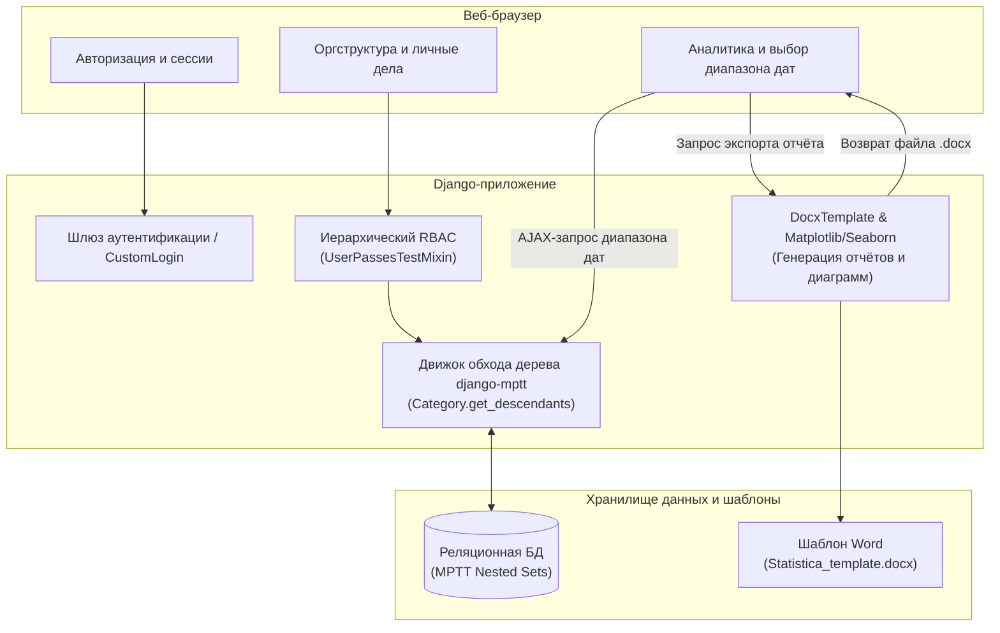

# Корпоративная система учёта эффективности и дисциплинарной практики персонала

<p align="center">
  <strong>Масштабируемая веб-платформа для контроля результатов работы сотрудников с рекурсивным моделированием оргструктуры предприятия</strong>
</p>

<p align="center">
  <a href="README.md"><b>English</b></a> | <a href="README.ru.md"><b>Русский</b></a>
</p>

<p align="center">
  
  
  
  
  
  
</p>

---

## 🏢 О проекте

**Enterprise Hierarchical Workforce & Discipline Tracking System** — это production-ready веб-платформа, созданная для организаций с глубокой древовидной структурой (Центральный офис $\to$ Филиалы $\to$ Департаменты $\to$ Отделы $\to$ Рабочие группы). Платформа систематизирует фиксацию достижений и взысканий сотрудников, автоматизирует аудит дисциплины, строит динамическую аналитику и генерирует официальные сводные отчёты в формате Word (.docx).

Система решает ключевую архитектурную задачу строгого разграничения полномочий: каждый руководитель видит и администрирует исключительно своё подразделение и все вложенные дочерние команды без риска утечки данных соседних отделов.

---

## 🎥 Демонстрация работы

<p align="center">
  
</p>

> [!NOTE]
> *Видеодемонстрация ключевых сценариев использования платформы: сквозная навигация по MPTT-оргструктуре подразделений, фиксация событий и поощрений сотрудников, динамический расчёт аналитики и выгрузка executive-отчётов в DOCX.*

---

## ⚡ Ключевые инженерные и архитектурные особенности

### 1. Рекурсивное моделирование оргструктуры (`django-mptt`)
* Алгоритм **Modified Preorder Tree Traversal (MPTT)** обеспечивает выборку любых ветвей оргструктуры за константное количество запросов.
* Мгновенный обход дерева любой глубины (`get_descendants(include_self=True)`) без рекурсивных SQL-запросов и деградации производительности (чтение дерева за $O(1)$).
* Интерактивное управление иерархией отделов через `django-mptt-admin`.

<p align="center">
  
</p>

### 2. Иерархический ролевой контроль доступа (RBAC)
* Строгие проверки прав на базе Django `UserPassesTestMixin`.
* Многоуровневая ролевая модель:
  * **Тимлид / Руководитель группы**: Просмотр и внесение записей строго для сотрудников своей команды.
  * **Руководитель направления / Директор**: Сводная видимость и контроль всех дочерних подотделов.
  * **Специалист / Сотрудник**: Доступ только к личному делу и персональной истории поощрений/замечаний.
* Непоследовательные slug-идентификаторы на базе транслитерации и соленых UUID для защиты от перебора ID (Insecure Direct Object Reference).

### 3. Автоматическая генерация отчётов в Word (`docxtpl`)
* Формирование документов `.docx` с корпоративным форматированием на основе динамических агрегаций из базы данных.
* Серверная генерация диаграмм на лету с помощью **Matplotlib** и **Seaborn** (работает в фоновом безголовом режиме через `plt.switch_backend('agg')`).
* Автоматическое внедрение сгенерированных графиков непосредственно в результирующий Word-шаблон.

### 4. Интерактивная аналитика и фильтрация по периодам
* Асинхронные AJAX-запросы для агрегации данных за произвольные диапазоны дат (достижения, замечания, устранения замечаний).
* Динамическая круговая диаграмма на клиенте на базе **Chart.js**.

<p align="center">
  
</p>

---

## 🏛️ Архитектура системы и потоки данных



---

## 📂 Структура проекта

```
disciplinary_practice_31_courses/
├── disciplinary_practice/     # Конфигурация и настройки проекта
│   ├── settings.py           # Настройки с поддержкой .env (SECRET_KEY, DEBUG)
│   ├── urls.py               # Корневые маршруты URL
│   ├── wsgi.py               # Точка входа WSGI
│   └── asgi.py               # Точка входа ASGI
├── docs/                      # Медиа-материалы (GIF / видео) и документация
├── main/                      # Основное бизнес-приложение
│   ├── models.py             # Модели Category (MPTT), CustomUser, Note
│   ├── views.py              # Представления RBAC, AJAX-аналитика, экспорт Docx
│   ├── forms.py              # Формы авторизации и добавления записей
│   ├── admin.py              # Конфигурация Django & MPTT админ-панели
│   ├── static/               # CSS, JS (Chart.js, Bootstrap 5), docx-шаблоны
│   └── templates/            # Корпоративные шаблоны интерфейса
├── .env.template             # Образец переменных окружения
├── requirements.txt          # Зависимости Python
└── manage.py                 # CLI управления Django
```

---

## 🚀 Руководство по установке и запуску

### 1. Предварительные требования
* Python 3.10 или выше
* Git

### 2. Клонирование и настройка виртуального окружения
```bash
# Переход в папку с проектом
cd disciplinary_practice_31_courses

# Создание виртуального окружения
python -m venv venv

# Активация виртуального окружения
# Для Linux/macOS:
source venv/bin/activate
# Для Windows (PowerShell):
.\venv\Scripts\Activate.ps1
```

### 3. Установка зависимостей
```bash
pip install -r requirements.txt
```

### 4. Настройка переменных окружения
Скопируйте `.env.template` в `.env` и настройте параметры:
```bash
cp .env.template .env
```

Отредактируйте `.env`:
```env
SECRET_KEY=generate_a_secure_random_key_here
DEBUG=True
ALLOWED_HOSTS=127.0.0.1,localhost
```

### 5. Применение миграций и создание суперпользователя
```bash
# Применение миграций базы данных
python manage.py makemigrations
python manage.py migrate

# Создание администратора
python manage.py createsuperuser
```

### 6. Запуск сервера разработки
```bash
python manage.py runserver
```

Откройте в браузере:
* **Основной интерфейс**: `http://127.0.0.1:8000/`
* **Админ-панель**: `http://127.0.0.1:8000/admin/`

---

## 📄 Лицензия
Проект распространяется под открытой лицензией **MIT License**.
